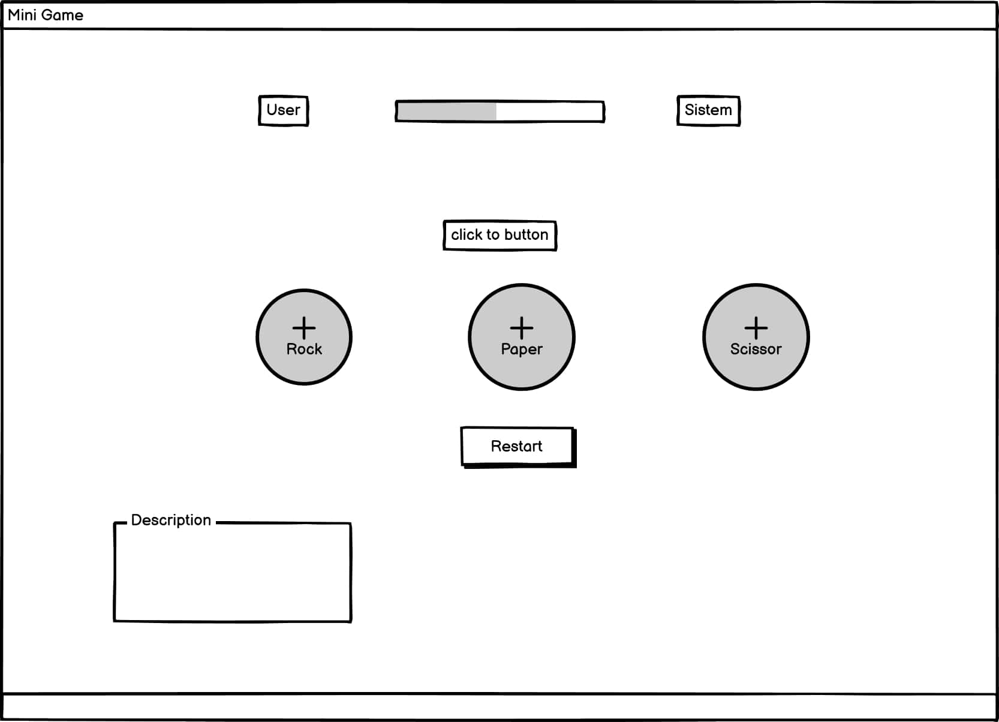

# Mini Game

- Users of this website wil be able to find all the information on main page
  
  ## Design
      
           
  
  - Wireframe  
               

  - Color schame "all the colors is the basic colors"
   1. lightblue   
   2. chocolate
   3. white
   4. grey
   5. green
   6. red
 
  -  I confirmed that the colors and fonts chosen are accessible and easy to read.
  ## Feautures
  - Languages Used : HTML , CSS , JavaScript
  - When click on icons show up
  - When win/loose message tell you
  - Clear description on bottom of the page
  ## Testing

  - Validator testing HTML  [W3C Validator]()
  - Validator testing CSS   [W3C validator]()
  
   

  ## Credit

  - Content
  1. The icons in the body were taken from  [Font Awesome](https://fontawesome.com/) 
  2. All the content in the project's documentation, including this README.md file, has been written by the developer.
  